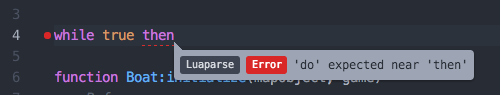

# linter-luaparse

> This repository is now archived due the the [deprecation of Atom](https://github.blog/2022-06-08-sunsetting-atom/).

A Lua linter for Atom using the Javascript library [luaparse](https://github.com/oxyc/luaparse). Since the plugin is purely Javascript, Lua does not even need to be installed. Unfortunately, luaparse only reports the first syntax error in a given file.
